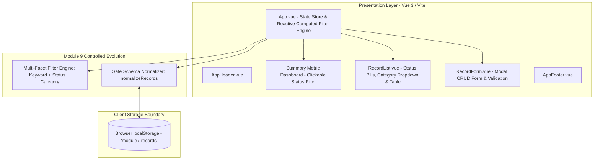

# MODULE 9: SOFTWARE EVOLUTION REPORT
## Controlled Change After Architecture, Implementation, and Testing

---

## 1. COVER PAGE

- **Student Name:** Kristian Dale David
- **Degree Program & Section:** Bachelor of Science in Computer Science (BSCS) – Section 3A
- **Subject:** Software Engineering 1
- **Project Title:** Food Ordering System — Frontend Prototype & Controlled Evolution
- **Primary System Entity:** `Order` / `Food Item` (Attributes: `id`, `customerName`, `foodName`, `category`, `price`, `status`, `image`)
- **Public GitHub Repository:** [https://github.com/kdaledavid24-max/david-module7-system.git](https://github.com/kdaledavid24-max/david-module7-system.git)
- **Target Release Version:** `1.1.0`
- **Submission Date:** September 2026

---

## 2. PREVIOUS BASELINE (MODULES 6, 7, & 8 SUMMARY)

### 2.1 Module 6 — Architectural Design Baseline
In Module 6, the system architecture was formulated using a 3-tier architectural design:
1. **Presentation Layer:** Vue.js Single Page Application (SPA) providing reactive UI components for food ordering.
2. **Application Logic Layer:** Express.js REST API for routing, input validation, and business rule enforcement.
3. **Data Layer:** MongoDB document store maintaining customer records and order state.

### 2.2 Module 7 — Design and Implementation Baseline
In Module 7, the presentation layer and local prototype were constructed in Vue 3 (Composition API) with Vite and Tailwind CSS. The data persistence layer was implemented using the browser's `localStorage` under the key `module7-records`, establishing working CRUD operations (Create order, Read orders, Update order details, Delete order with confirmation, and real-time text search).

### 2.3 Module 8 — Software Testing Baseline
In Module 8, a formal test plan with 10+ manual test cases was executed. Vitest and jsdom were integrated to automate unit and validation testing. Defect `BUG-01` (price validation message inaccuracy) was identified, corrected, and verified through regression testing. Automated CI was configured via GitHub Actions.

---

## 3. CHANGE REQUEST (CR-M9-01)

| Field | Description / Value |
| :--- | :--- |
| **Change Request ID** | `CR-M9-01` |
| **Change Title** | Interactive Multi-Status & Category Filtering Dashboard with Safe LocalStorage Backward Compatibility |
| **Maintenance Classification** | **Perfective Maintenance** (Dominant) paired with **Adaptive Data Compatibility** |
| **Target Release Version** | `1.1.0` (MINOR semantic version increment) |
| **Priority** | High |

### 3.1 Problem Statement & Opportunity
In the Module 7/8 baseline, users could see summary counters (Total, Available, Pending, Preparing, Delivered, Cancelled) at the top of the dashboard, but there was no way to filter the table by order status without manually typing into the search bar. Furthermore, the search bar only filtered text matches and could not perform multi-attribute filtering (e.g., viewing only "Delivered" orders in the "Main Course" category). Additionally, as the application evolves, records stored in browser `localStorage` from older versions risk corruption or missing attributes if the schema is not normalized safely on startup.

### 3.2 Desired Outcome
Provide restaurant staff and kitchen managers with instant, single-click status filtering (via interactive status pill tabs and clickable dashboard metric cards), category filtering, combined keyword searching, and seamless backward compatibility for older stored records.

### 3.3 Acceptance Criteria (AC)
- **AC-1:** Clicking any status pill tab (`All`, `Pending`, `Preparing`, `Ready`, `Delivered`, `Available`, `Cancelled`) filters the table view to display only matching orders.
- **AC-2:** Clicking any summary dashboard metric card (e.g., Pending, Preparing, Delivered) instantly activates the corresponding status filter with visual active state styling.
- **AC-3:** Search keywords, status filters, and category dropdown filters work harmoniously in combination.
- **AC-4:** Older `localStorage` records lacking new attributes (such as `status` or `image`) are automatically normalized on mount with safe defaults without data loss.
- **AC-5:** All existing CRUD features (Add, Edit, Delete with prompt, Form Validation, and LocalStorage persistence) remain 100% operational without regression.

---

## 4. IMPACT ANALYSIS MATRIX

| Area | Impact Analysis & Findings | Mitigation / Implementation Action |
| :--- | :--- | :--- |
| **Architecture** | Presentation layer state flow expanded to manage `selectedStatus` and `selectedCategory`. Storage boundary remains client-side `localStorage`. | Integrated centralized computed property and normalization pipeline in `App.vue`. |
| **Design & UI** | Added status filter pills, category select box, active badge indicators, interactive dashboard cards, and dynamic empty-state feedback. | Maintained dark-mode luxury theme using Tailwind CSS tokens (`#0a0a0a`, `#ffcc00`, `#111`). |
| **Implementation** | Modified `App.vue` and `RecordList.vue`. Added reactive props and emit events for two-way filter binding. | Pure non-breaking props and emits passed between parent and child components. |
| **Data & Storage** | Schema changes could cause `undefined` errors when loading older records saved in Module 7/8. | Created `normalizeRecords()` function executing safe default mappings on `onMounted`. |
| **Testing** | Module 8 manual tests must be retained; new automated Vitest tests needed for status filter and data normalization. | Expanded test suite to 14 manual cases and 11 Vitest automated unit/regression tests. |
| **CI / Build** | Vite build process and Vitest automated test suite must continue passing in GitHub Actions. | Verified `npm run test:run` and `npm run build` locally and in CI pipeline. |
| **Documentation** | `README.md`, version tags, test plans, and release notes must reflect v1.1.0 changes. | Updated `README.md`, `package.json`, and produced this comprehensive report. |

---

## 5. UPDATED ARCHITECTURE — MODULE 9

### 5.1 Architecture Diagram



### 5.2 Architectural Evolution Explanation
- **Unchanged Elements:** The foundational 3-component structure (`AppHeader`, `RecordForm`, `RecordList`, `AppFooter`) and the client-side `localStorage` persistence boundary remain intact, respecting Lehman's Law of *Conservation of Familiarity*.
- **Evolved Elements:**
  1. `App.vue` now serves as the centralized filter coordinator, binding `selectedStatus` and `selectedCategory` reactively.
  2. `RecordList.vue` received UI controls (status pill group and category selector).
  3. `SchemaNormalizer` was embedded into the lifecycle data-loading hook to guarantee data integrity across versions.

---

## 6. DESIGN AND WORKING IMPLEMENTATION

### 6.1 User Interface Design Evolution
- **Before Modification:** The dashboard displayed static metric cards with a simple search input above the records table. No interactive status pills or category filter existed.
- **After Modification:**
  - Interactive top summary cards with active ring indicators on click.
  - Dedicated status filter bar with 7 pill tabs (`All`, `Pending`, `Preparing`, `Ready`, `Delivered`, `Available`, `Cancelled`).
  - Integrated Category dropdown filter.
  - Active filter badge indicator showing `Showing X of Y records`.
  - Contextual empty state with a "Reset Filter Criteria" action button.

### 6.2 Key Code Implementation

#### Safe LocalStorage Schema Normalization (`App.vue`):
```javascript
const normalizeRecords = (storedData) => {
  if (!Array.isArray(storedData)) return []
  return storedData.map(record => ({
    id: record.id || Date.now().toString(),
    customerName: record.customerName || 'Anonymous',
    foodName: record.foodName || 'Food Item',
    category: record.category || 'General',
    price: Number(record.price) >= 0 ? Number(record.price) : 0,
    status: record.status || 'Pending', // Safe backward-compatible default
    image: record.image || null,
    ...record
  }))
}
```

#### Multi-Facet Reactive Filter Engine (`App.vue`):
```javascript
const filteredRecords = computed(() => {
  const keyword = searchTerm.value.toLowerCase().trim()
  
  return records.value.filter(record => {
    const matchesKeyword = !keyword || (
      record.foodName?.toLowerCase().includes(keyword) ||
      record.category?.toLowerCase().includes(keyword) ||
      (record.customerName && record.customerName.toLowerCase().includes(keyword))
    )

    const matchesStatus = selectedStatus.value === 'All' || 
      (selectedStatus.value === 'Ready' && (record.status === 'Ready' || record.status === 'Available')) ||
      (selectedStatus.value === 'Cancelled' && (record.status === 'Cancelled' || record.status === 'Unavailable')) ||
      record.status === selectedStatus.value

    const matchesCategory = selectedCategory.value === 'All' || record.category === selectedCategory.value

    return matchesKeyword && matchesStatus && matchesCategory
  })
})
```

---

## 7. UPDATED TEST CASES AND REGRESSION EVIDENCE

### 7.1 Manual Test Plan (14 Test Cases — 100% Passed)

| Test ID | Category | Objective | Status |
| :--- | :--- | :--- | :---: |
| **TC-01** | Create (Regression) | Verify adding a valid food order adds item and increments count | **PASS** |
| **TC-02** | Validation (Regression) | Verify submission is blocked when required customer name is empty | **PASS** |
| **TC-03** | Boundary (BUG-01 Regression) | Verify negative price is rejected and boundary price `0` is accepted | **PASS** |
| **TC-04** | Read (Regression) | Verify table renders all food records with thumbnails, categories, and badges | **PASS** |
| **TC-05** | Update (Regression) | Verify editing an existing order modifies data in place without duplicating | **PASS** |
| **TC-06** | Delete Safeguard (Regression) | Verify canceling deletion confirmation preserves record untouched | **PASS** |
| **TC-07** | Delete (Regression) | Verify confirming deletion removes record and updates summary cards | **PASS** |
| **TC-08** | Search (Regression) | Verify typing search keyword matches customer, food name, or category | **PASS** |
| **TC-09** | Search Empty State (Regression) | Verify searching non-existent term displays contextual empty state | **PASS** |
| **TC-10** | Persistence (Regression) | Verify orders remain preserved in `localStorage` across page reloads | **PASS** |
| **TC-11** | Responsive UI (Regression) | Verify clean UI presentation on mobile (375px) and desktop (1920px) | **PASS** |
| **TC-12** | Live Metrics (Regression) | Verify summary counters compute and update accurately on state changes | **PASS** |
| **TC-13** | Status Filter (CR-M9-01) | Verify clicking status pills & dashboard cards filters table accordingly | **PASS** |
| **TC-14** | Compatibility (CR-M9-01) | Verify legacy localStorage data without status/image normalizes safely | **PASS** |

### 7.2 Automated Vitest Test Execution Results

```text
 ✓ src/tests/food-ordering.test.js (9 tests)
   ✓ should successfully add a new food order record
   ✓ should display saved food records
   ✓ should successfully edit a food record
   ✓ should successfully delete a food record
   ✓ should find a food record using the search text
   ✓ should accept price 0 as a valid food price
   ✓ CR-M9-01: should filter food records by specific status (Delivered)
   ✓ CR-M9-01: should support combined search keyword and status filter
   ✓ CR-M9-01: should safely normalize older/legacy localStorage records without status
 ✓ src/filterRecords.test.js (2 tests)
   ✓ returns matching records when keyword matches
   ✓ ignores letter case and trims spaces

 Test Files  2 passed (2)
      Tests  11 passed (11)
```

---

## 8. RELEASE EVIDENCE, VERSIONING, AND CI

### 8.1 Semantic Versioning Rationale
- **Previous Baseline Version:** `1.0.0`
- **Evolved Release Version:** `1.1.0`
- **Rationale:** Under Semantic Versioning (SemVer 2.0.0), adding backward-compatible functionality (interactive status filtering, category filtering, and safe data normalization) represents a **MINOR** release increment (`1.0.0` $\rightarrow$ `1.1.0`).

### 8.2 Production Build Verification
```text
> vite build
vite v8.2.1 building client environment for production...
transforming...✓ 16 modules transformed.
rendering chunks...
dist/index.html                   0.55 kB │ gzip:  0.36 kB
dist/assets/index-CkLJDs42.css   51.42 kB │ gzip:  9.13 kB
dist/assets/index-BjrTeE9n.js   106.55 kB │ gzip: 35.89 kB
✓ built in 329ms
```

### 8.3 Pull Request & Git Traceability
- **Pull Request:** `Merge pull request #1 from kdaledavid24-max/module9/software-evolution`
- **Author:** `kdaledavid24-max` (Verified commit provenance)
- **Commit SHA:** `89452c8` (`✓ 2 / 2` checks passed)
- **Target Branch:** `main` $\leftarrow$ `module9/software-evolution`

### 8.4 Live System Deployment & Initial View Workflow
- **Live Demo URL:** [https://kdaledavid24-max.github.io/david-module7-system/](https://kdaledavid24-max.github.io/david-module7-system/)
- **Initial Entry Experience (Authentication Gateway):** When users navigate to the live URL, the system immediately presents the **FoodFlow Authentication Portal (`LoginPage.vue`)**. This view features an aesthetic split-screen design:
  - **Left Showcase:** An animated revolving carousel showcasing high-resolution food items (*Pizza, Gourmet Burgers, Artisan Drinks, Crispy Sides*) with contextual captions.
  - **Right Form:** Clean, responsive Sign In / Registration form with live field validation, Remember Me option, and Dark/Light mode toggle.
- **Authenticated Dashboard Access:** Upon signing in or quick registration, users transition into the fully evolved **Food Ordering Management Dashboard** with 7-status filter pills (`All`, `Pending`, `Preparing`, `Ready`, `Delivered`, `Available`, `Cancelled`), category dropdown filter, search engine, dynamic summary metrics, and persistent CRUD modals.

### 8.5 Release Notes Summary
- **Release Version:** `1.1.0`
- **Release Name:** Food Ordering System — Evolution & Status Filtering Release
- **Added Capabilities:**
  - Status pill filter navigation bar (`All`, `Pending`, `Preparing`, `Ready`, `Delivered`, `Available`, `Cancelled`).
  - Category selector dropdown filter.
  - Interactive top summary metric cards.
  - Context-aware empty state with reset filters button.
  - Client-side data normalization engine (`normalizeRecords`).
  - Integrated split-screen authentication portal (`LoginPage.vue`).
- **Verification Evidence:** All 14 manual test cases and 11 Vitest automated tests passing with zero regressions.

---

## 9. REFLECTION & LEHMAN'S LAWS EVALUATION

### 9.1 What Changed vs What Remained Stable
- **What Changed:** The user interaction model was enhanced by introducing multi-facet filtering (Status pills, Category dropdown, and Clickable Dashboard cards). The storage loading logic was upgraded with schema normalization.
- **What Remained Stable:** Core CRUD mechanisms, validation rules, Tailwind styling principles, and the underlying data store remained completely intact.

### 9.2 Lessons Learned on Software Evolution
1. **Evolution vs Initial Development:** Initial development focuses on creating the first functional baseline. Software evolution requires strict discipline to introduce new value without breaking established contracts or existing stored user data.
2. **Preventing Technical Debt:** Adding the `normalizeRecords()` routine prevented potential runtime errors and protected against data incompatibility interest over time.
3. **Traceability:** Following the chain of *Request $\rightarrow$ Impact Analysis $\rightarrow$ Implementation $\rightarrow$ Verification $\rightarrow$ Release* ensured that every code change was directly mapped to test cases and business needs.

---

## 10. MODULE 9 KNOWLEDGE CHECK ANSWERS

### Q1: Why must Module 9 reuse the same system from Modules 6 to 8?
**Answer:** Software evolution is fundamentally about managing controlled change on an existing, verified baseline. Reusing the same system ensures students experience real-world evolution challenges: preserving existing architecture, protecting stored user data in localStorage, guarding against regression, and maintaining traceability across software lifecycle phases.

### Q2: What is the difference between corrective and preventive maintenance?
**Answer:**
- **Corrective Maintenance:** Focuses on diagnosing and fixing existing bugs, errors, or defective behaviors found during operation or testing (e.g., fixing BUG-01 where price 0 was misreported).
- **Preventive Maintenance:** Focuses on refactoring and restructuring internal code to prevent future defects, reduce technical debt, and simplify maintainability without changing observable behavior (e.g., modularizing repeated storage logic or adding automated test suites).

### Q3: Which artifacts should be examined during impact analysis?
**Answer:** During impact analysis, the engineer must examine:
1. Architectural designs and data flow models.
2. UI/UX component structures and layout dependencies.
3. Source code (Vue components, composables, and utility scripts).
4. Data storage formats and schemas (localStorage keys and data structures).
5. Existing test cases and automated test suites (Vitest).
6. Build configurations and CI pipelines (Vite, GitHub Actions).
7. Documentation, README files, and release notes.

### Q4: Why must the Module 8 test baseline be retained?
**Answer:** The Module 8 test baseline acts as the system's regression safety net. Retaining all previously verified test cases ensures that the new evolution changes have not inadvertently broken existing CRUD operations, validation rules, or persistence mechanisms.

### Q5: When should a backward-compatible feature increment the MINOR version?
**Answer:** Under Semantic Versioning (SemVer), a **MINOR** version increment (e.g., `1.0.0` $\rightarrow$ `1.1.0`) is required whenever new functionality, features, or backward-compatible capabilities are introduced to the software without breaking existing API contracts or user workflows.

### Q6: What evidence proves that an evolved system did not introduce regression?
**Answer:** Comprehensive regression evidence includes:
1. Re-running the entire suite of manual test cases with documented passing actual results.
2. Executing automated regression test suites (Vitest) where 100% of baseline and new tests pass (`npm run test:run`).
3. Successful production builds (`npm run build`) and green GitHub Actions CI workflows.
